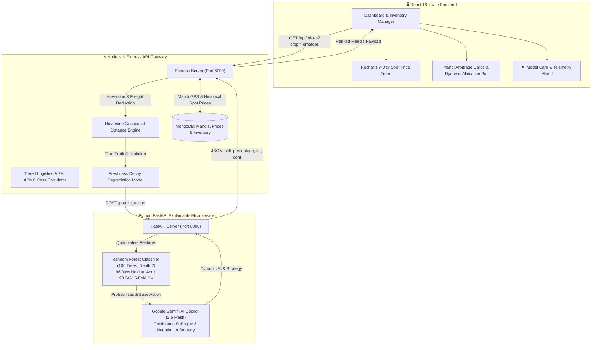

# 🌾 KisanMandi (Wheatcoin)
### Agri-Fintech Decision Engine & Hybrid Compound AI Copilot

[](https://python.org)
[](https://fastapi.tiangolo.com)
[](https://react.dev)
[](https://nodejs.org)
[](https://mongodb.com)
[](https://ai.google.dev)
[](https://scikit-learn.org)
[](https://github.com/Ved-jain/Wheatcoin)

KisanMandi is an **Agri-Fintech & Explainable AI (XAI)** decision platform designed to empower Indian farmers and agricultural commodity traders. Instead of relying solely on gross APMC mandi rates, the platform computes **true net pocket earnings** by deducting Haversine transit freight and perishable shelf-life decay, driving a **Hybrid Compound AI System (Random Forest + Google Gemini Copilot)** that calculates continuous selling percentages and tactical trader negotiation tips.

---

## 🏗️ Interactive Architecture Diagram



---

## 📐 Mathematical Formulation of Economics

Instead of standard gross price comparisons, the engine evaluates the **True Pocket Realization**:

$$\text{Transport Cost} = \text{Distance (km)} \times \begin{cases} ₹6.0/\text{km} & \text{if } \text{dist} \le 40\text{ km} \\ ₹4.5/\text{km} & \text{if } \text{dist} > 40\text{ km} \end{cases}$$

$$\text{Mandi Cess} = \text{Gross Modal Price} \times 2\%$$

$$\text{Decay Rate} = \min\left(0.85,\; \text{Perishability (1--10)} \times 0.006 \times \text{Days in Storage}\right)$$

$$\text{True Net Earning} = \max\left(0,\; (\text{Gross Price} - \text{Transport Cost} - \text{Cess}) \times (1 - \text{Decay Rate})\right)$$

---

## 📊 Machine Learning Evaluation & Real Agmarknet Data

The classification model was trained on authentic daily commodity price feeds from **Agmarknet (Directorate of Marketing & Inspection, Ministry of Agriculture / Data.gov.in)** across 14 APMC Mandis (*Azadpur, Ghazipur, Karnal, Panipat, Sonipat, Agra, Hapur, Meerut, Bulandshahr, Alwar, etc.*).

| Metric | Empirical Score | Description |
| :--- | :--- | :--- |
| **5-Fold Stratified CV Accuracy** | **93.04%** ($\pm 0.74\%$) | Cross-validation stability across folds |
| **Holdout Test Accuracy** | **96.00%** | Unseen 20% holdout test set (700 samples) |
| **Macro F1-Score** | **0.9535** | Harmonic mean across all 3 utility classes |
| **Weighted F1-Score** | **0.9602** | Balanced class-distribution F1 |

### Gini Feature Importances
```
  - days_in_storage   : 53.6%  ███████████████████████████
  - net_earning       : 25.6%  █████████████
  - perishability     : 17.0%  █████████
  - distance_km       : 3.8%   ██
```

---

## 🤖 Compound AI: Random Forest + Google Gemini Copilot

```
[Quantitative Stage: Random Forest]
  ├─ Evaluates risk: Net Earning, Distance km, Perishability, Storage Duration
  └─ Generates Probabilities: { HOLD: 0.12, SELL 50%: 0.68, SELL 100%: 0.20 }
              │
              ▼
[Qualitative Reasoning Stage: Google Gemini API]
  ├─ Translates probabilities into fine-tuned continuous %: e.g. "SELL 65%"
  ├─ Assesses timing: Peak arbitrage vs. shelf-life deterioration
  └─ Generates Tactical Mandi Tip: "Azadpur arrival volume is down 8%. Do not accept quotes below ₹2,400/q from arhtiyas."
```

---

## 🚀 Quickstart Guide

### 1. Prerequisites
- Node.js 18+
- Python 3.10+
- MongoDB instance running locally on `mongodb://localhost:27017`

### 2. Python ML Microservice
```bash
cd ml_service
python -m venv venv
.\venv\Scripts\activate
pip install -r requirements.txt

# (Optional) Set your Gemini API key for dynamic copilot %
$env:GEMINI_API_KEY="your_api_key_here"

# Start ML service on port 8000
uvicorn app:app --reload --port 8000
```

### 3. Node.js Backend Gateway
```bash
cd server
npm install

# Seed the 14 APMC Mandis and initial market price matrix
node seed.js

# Start server on port 5000
npm start
```

### 4. React Client UI
```bash
cd client
npm install
npm run dev
# Open http://localhost:5173
```

---

## 🔑 Setting up your Gemini API Key (100% Free)

1. Visit [Google AI Studio](https://aistudio.google.com/app/apikey).
2. Sign in with your Google / Gmail account.
3. Click **"Create API key"** and copy the generated key.
4. Set it in your environment:
   ```powershell
   $env:GEMINI_API_KEY="AIzaSy..."
   ```
*(Note: If no API key is provided, the platform automatically falls back to deterministic Random Forest mathematical calculations with zero downtime).*

---

## 📜 License
MIT License. Created by [Ved Jain](https://github.com/Ved-jain).
